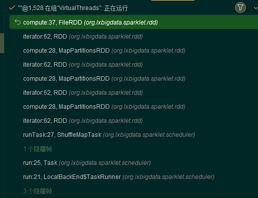

# Sparklet核心设计

## 工具类设计

### Stream of ByteBuffer

#### off-heap的好处

以Linux平台为例子，JVM是一个进程，`CPU`切换到用户态的时候，只能访问到虚拟地址空间内的限定区域。如果需要执行内核代码，就必须将`CPU`切换为内核态，然后`trap`让其跳转到虚拟地址空间的`内核`代码与数据区域。

上述的CPU从内核态到用户态的转换，开销是寄存器状态，以及栈的状态的存储，其实并没有很多人所说的上下文切换。

目前看起来开销可以接受。

但是当需要网络获取数据的时候，`CPU`处于用户等级的时候并无法操作这个数据，必须先切换到内核态，然后`CPU`将数据从全局内存，复制到该进程的地址空间的管理的内存区域，这个开销是很大的。

所以`off-heap`的基本实现，就是首先在系统内存分配区域，然后在用户进程中分配一个代表`off-heap`区域的虚拟地址，这样当用户态的`CPU`访问该虚拟地址的时候，经过`MMU`映射，可以映射到之前分配过的系统内存区域。

#### 和ByteArrayxxxStream

Java IO 已经有了`ByteArray`流，为什么还要使用`ByteBuffer`流呢？

这其实涉及到框架的管理问题。如果一个流的来源只是`on-heap`，那么使用`byte[]`足够了。

但是大数据计算框架等通常出于GC，或者开销问题，会使用到堆外内存，也就是`off-heap`。

这个时候有一个统一管理的API就很重要了，并且，可以使用流的方式管理块粒度的IO，所以就有了`Stream of ByteBuffer`。

#### 具体设计

> [java - Wrapping a ByteBuffer with an InputStream - Stack Overflow](https://stackoverflow.com/questions/4332264/wrapping-a-bytebuffer-with-an-inputstream)

对于`ByteBufferInputStream`，需要注意，从该流读取数据之前必须`filp`，因为没有内置的`filp`逻辑。

对于`ByteBufferOutputStream`，就是一个`ByteArrayOutputStream`，但是它的`toByteBuffer`直接复用了原有的数组，减去了读出再写的开销，可以视作零拷贝。

```java
    val stream = new ByteBufferOutputStream()
    val str = "hello world".getBytes(StandardCharsets.UTF_8)
    stream.write(str)
    stream.close()
    val buffer = stream.toByteBuffer //直接复用原有数组，获取ByteBuffer
    val bytes = buffer.array().takeWhile(_ != 0)
    val result = new String(bytes, StandardCharsets.UTF_8)

    assert(result == "hello world")
```

```java
    val offHeapBuffer = ByteBuffer.allocateDirect(1024)
    val str = "hello world".getBytes(StandardCharsets.UTF_8)
    offHeapBuffer.put(str)

    offHeapBuffer.flip() //一定要调用flip()切换一下

    val stream = new ByteBufferInputStream(offHeapBuffer)
    val bytes = stream.readAllBytes()
    val result = new String(bytes, StandardCharsets.UTF_8)

    assert(result == "hello world")
```

#### 经典问题与off-heap管理

> [Java堆外内存之三：堆外内存回收方法 - duanxz - 博客园 (cnblogs.com)](https://www.cnblogs.com/duanxz/p/6089485.html)

on-heap分配的内存受GC管理，那off-heap的程序运行时的管理受GC影响较小，必然要涉及到`unsafe-api`的操作。

很多人在使用大数据计算框架,更新到`JDK17`的时候,会遇到关于`unsafe`的API管理报错根本原因就是这里的管理使用了相关API。

具体管理函数设计如下:

```java
  private def clean(buffer: ByteBuffer): Unit = {
    if (buffer.isDirect) {
      val cleaner = buffer.asInstanceOf[DirectBuffer].cleaner()
      cleaner.clean()
    }
  }

```

当然，一个`clean`函数的注册是需要具体对象，以及操作函数的，`JDK-nio`中的处理函数对象如下:

```java
    private record Deallocator(long address, long size, int capacity) implements Runnable {
        private Deallocator {
            assert address != 0;
        }

        public void run() {
            UNSAFE.freeMemory(address);
            Bits.unreserveMemory(size, capacity);
        }
    }
```

在具体设计的时候，就可以根据是否要真正清理而选择上述的`unsafe-api`，而不是使用并不真正清理数据的`ByteBuffer::clear`。

`Spark`框架在具体的`Storage-util`的工具类中就有类似实现，所以会导致用户升级`JDK`之后出问题。

### Next Iterator

#### 增强之处

[内存有限的情况下 Spark 如何处理 T 级别的数据？ - 知乎 (zhihu.com)](https://www.zhihu.com/question/23079001)

其实流式迭代器正是人们宣扬的`Spark`的懒惰加载，或者说是`RDD定义逻辑不进行计算`的根本，和全部读取到内存相比，其好处是很明显的。**它的真正实现并不是人们认为的`lazy关键字`方式实现**。这点后面会专门出文章。

其暴露出很少的构成迭代器的方法，以及关闭的逻辑给用户需要管理进行实现。

用户可以将任何其想进行管理的资源转换为迭代器方式进行读取。

#### 自定义

```java
  def asIterator: Iterator[Any] = new NextIterator[Any] {
    override protected def getNext() = {
      try {
        readObject[Any]()
      } catch {
        case eof: EOFException =>
          finished = true
      }
    }

    override protected def close() {
      DeserializationStream.this.close()
    }
  }
```

我们可以自己写一个小例子来感受功能：

```java
  def test01(): Unit = {
    val iter = new NextIterator[Int] {
      override protected def getNext(): Int = {
        (math.random()*6).toInt
      }
      override protected def close(): Unit = {
        println("close")
      }
    }
    var ans = 0
    if(iter.hasNext){
      ans = iter.next()
    }
    iter.closeIfNeeded()
    println(ans)
    assert(ans >= 0)
  }
```

## 序列化器设计

### 序列化trait

#### 序列化流

首先是很常规的`序列化流`

```java
trait SerializationStream {
  def writeObject[T: ClassTag](t: T): SerializationStream
  def flush(): Unit
  def close(): Unit

  def writeAll[T: ClassTag](iter: Iterator[T]): SerializationStream = {
    while (iter.hasNext) {
      writeObject(iter.next())
    }
    this
  }
}
```

序列化流唯一需要功能就是将对象序列化之后写出去，当然这里提供了一个默认实现来将迭代器的数据全部写出去。

**核心是反序列化器**

为什么，想一想大数据引擎中必须要谈的`Shuffle`。

上面已经说过,`Spark`的实现中，数据是通过`RDD`上`Compute`闭包的堆叠计算之后，计算出最终结果的。那我们如何将含有`Shuffle`的前后数据通过迭代器串联起来呢？

实现方式就是将`fetch/源数据`的数据同样转换为迭代器，这样就可以将一个阶段，甚至多个阶段的内的逻辑串联起来了。

```java
trait DeserializationStream {
  def readObject[T: ClassTag](): T
  def close(): Unit

  /**
   * Read the elements of this stream through an iterator. This can only be called once, as
   * reading each element will consume data from the input source.
   */
  def asIterator: Iterator[Any] = new NextIterator[Any] {
    override protected def getNext() = {
      try {
        readObject[Any]()
      } catch {
        case eof: EOFException =>
          finished = true
      }
    }

    override protected def close() {
      DeserializationStream.this.close()
    }
  
```

刚好也用上了我上面写的小`demo`。

### 序列化实例

#### 自定义类加载

自定义的类的序列化和反序列化，依旧需要使用`ObjectStream`，但是需要重写方法，并提供类加载器。

当加载失败的时候，需要回退到常规类型搜索一遍，然后抛出异常。

映射方式如下：

```java
  val primitiveMappings = Map[String, Class[_]](
    "boolean" -> classOf[Boolean],
    "byte" -> classOf[Byte],
    "char" -> classOf[Char],
    "short" -> classOf[Short],
    "int" -> classOf[Int],
    "long" -> classOf[Long],
    "float" -> classOf[Float],
    "double" -> classOf[Double],
    "void" -> classOf[Unit])
```

## 算子设计

### 分区器

分区器处理的是RDD的内部数据如何进行分配，常见的有三种内部分区方式:

* 水平分区
* Hash分区
* Range分区

#### Hash分区器

哈希分区器的唯一成员变量，就是`分区数量`。因为具体的Hash逻辑就是只依赖的就是输入ID和其分区数量。

具体分区逻辑如下：key的hashcode就是其分区编号。

```java
  override def getPartition(key: Any): Int = key match {
    case x if x != null => {
      val k = x.hashCode()
      val rawMod = k % partitions
      rawMod +(if (rawMod < 0) numPartitions  else 0)
    }
    case _ => 0 //这里null的分区全部是0,也是数据倾斜的来源之一
  }
```

#### Null值处理

`Null`值造成数据倾斜的原因，就在分区这里。上述的模式匹配下，大量的键值为`Null`的数据被分到了同一个0号分区。这会造成下游的`stage`分区数量之间可能存在严重的不平衡。

#### Range分区器

`Range`分区器的实现难度远远超过了`Hash`分区器。

所以这里只讨论设计思路，暂不给出具体实现。

```java
/**
 * partitions sortable records by range into roughly
 * equal ranges. The ranges are determined by sampling the content of the RDD passed in.
 */
class RangePartitioner[K : Ordering : ClassTag, V](
    partitions: Int,
    @transient rdd: RDD[_ <: Product2[K,V]],
    private val ascending: Boolean = true)
  extends Partitioner {

  private val ordering = implicitly[Ordering[K]]

  // An array of upper bounds for the first (partitions - 1) partitions
  private val rangeBounds: Array[K] = {
    if (partitions == 1) {
      Array()
    } else {
      val rddSize = rdd.count()
      val maxSampleSize = partitions * 20.0
      val frac = math.min(maxSampleSize / math.max(rddSize, 1), 1.0)
      val rddSample = rdd.sample(false, frac, 1).map(_._1).collect().sorted
      if (rddSample.length == 0) {
        Array()
      } else {
        val bounds = new Array[K](partitions - 1)
        for (i <- 0 until partitions - 1) {
          val index = (rddSample.length - 1) * (i + 1) / partitions
          bounds(i) = rddSample(index)
        }
        bounds
      }
    }
  }

  def numPartitions = partitions

  private val binarySearch: ((Array[K], K) => Int) = CollectionsUtils.makeBinarySearch[K]

  def getPartition(key: Any): Int = {
    val k = key.asInstanceOf[K]
    var partition = 0
    if (rangeBounds.length <= 128) {
      // If we have less than 128 partitions naive search
      while (partition < rangeBounds.length && ordering.gt(k, rangeBounds(partition))) {
        partition += 1
      }
    } else {
      // Determine which binary search method to use only once.
      partition = binarySearch(rangeBounds, k)
      // binarySearch either returns the match location or -[insertion point]-1
      if (partition < 0) {
        partition = -partition-1
      }
      if (partition > rangeBounds.length) {
        partition = rangeBounds.length
      }
    }
    if (ascending) {
      partition
    } else {
      rangeBounds.length - partition
    }
  }

  override def equals(other: Any): Boolean = other match {
    case r: RangePartitioner[_,_] =>
      r.rangeBounds.sameElements(rangeBounds) && r.ascending == ascending
    case _ =>
      false
  }
}
```

可以看到，`Range`分区器的成员变量不止`numpartition`，并且还有一个`RDD`，用于抽样查看数据分布。

具体这里使用到了`RDD::sample`方法，对其中的分区的数据进行采样，**这里是会触发计算任务的，即Action**。

首先，对传入的`RDD`进行采样，将采样的数据进行排序，称为范围边界(`Array[K]`)。

然后对进来的每个`key`，进行线性/二分查找，然后将其划分到具体的某个值范围中。

可以看到，整体来说这是对数据做了一次粗粒度的排序。

可以写一个小`demo`，查看一下,比如使用`spark-sql`中的`orderby`算子

```plaintext
+- == Initial Plan ==
   Sort [score#23 ASC NULLS FIRST], true, 0
   +- Exchange rangepartitioning(score#23 ASC NULLS FIRST, 200), ENSURE_REQUIREMENTS, [plan_id=27]
      +- FileScan csv [id#17,name#18,age#19,height#20,weight#21,handsome#22,score#23] Batched: false, DataFilters: [], Format: CSV, Location: InMemoryFileIndex(1 paths)
```

可以看到，`shuffle`的时候进行的是`rangepartition`，然后之后在每个分区内做排序，即可达到全局排序。

#### 和SortShuffle?

可能会有疑问，说既然`rangepartition`可以进行`partition`粒度的排序，然后`sort-based-shuffle`也是分区粒度的排序，那为什么还需要前者呢？

我在这里看过源码之后并没有找到两者有结合的方式，并且`shuffle`也不止一种`hash-based`，可以看我的技术博客中总结的`sql`剖析，`sparksql`一共5种`shuffle`，还有`sort-based`，所以`rangepartition`就很有必要了。

### RDD

#### 抽象类

**构造器**

一个RDD抽象类，其主构造器针对的是通用情况，也就是上游依赖有多个。当是`OneToOne`的时候，会有一个辅助构造器。

**成员变量**

* 运行上下文信息
* 上游依赖
* id

**方法**

其方法分为多类，具体如下:

* 依赖
  * 获取上游依赖
* 分区
  * 获得该RDD的内部分区器
  * 获得该RDD的所有分区集合(通过`Partition`类抽象),每个算子都应该实现这个抽象方法。
* 迭代计算
  * 该RDD包装的计算逻辑(`compute`)
  * 计算结果迭代器
* 通用高阶函数
  * transform方法
  * action方法

#### FileRDD

FIleRDD的功能就是从文件将数据通过迭代器方式读取进来。这里使用的迭代器是`Scala`的迭代器，并不是增强迭代器。它总是第一个算子，所以父RDD为空。

**获取分区集合**

此处的思路，是针对每个文件，包一个分区，并没有文件切片的实现。

```java
  override def getPartitions: Array[Partition] = {
    import scala.collection.JavaConverters._
    val directoryStream = Files.newDirectoryStream(Path.of(path))
    var i = 0
    directoryStream
      .iterator()
      .asScala.
      filter(_.toFile.length > 0)
      .map(file => {
        //localFile:目录下的一个小文件对应一个partition
        //这里可以使用自增id
        val partition = new FilePartition(id, i, file.toFile.getAbsolutePath)
        i += 1
        partition
      }).toArray
  }
```

**将分区文件转换为迭代器**

直接将每个分区对应文件通过`Source.fromFile`读进来，就是一个迭代器。


#### ShuffledRDD

首先声明一点，就是ShuffledRDD是在下游的,也就是一个Stage的开头。

所以很显然，它包装的`compute`逻辑就是shuffle read。

所以它的父RDD，就是上游的RDD，即提供给数据让shuffleRDD生成每个分区的RDD。

#### Shuffle发生时机

既然ShuffledRDD只会进行shuffleRead，那么ShuffleWrite在哪里进行呢？

其实在runtask的逻辑里面。Spark的Stage分为mapStage和resultStage，同样的，任务分为ShuffleMapTask以及ResultTask。其中的mapStage最后，总是会进行ShuffleWrite。

下面来看ShuffleMapTask：

显然，在ShuffleMapTask，进行的就是ShuffleWrite。

```java
  override def runTask(context: TaskContext): MapStatus = {
    println("shuffleMapTask开始执行" + Thread.currentThread().getName)
    val manager = new HashShuffleManager()
    val writer = manager.getWriter[Any,Any](dep.shuffleHandle, partitionId, context)
    writer.write(rdd.iterator(partition, context).asInstanceOf[Iterator[_ <: Product2[Any,Any]]])
    return writer.stop(success = true).get
  }
```


#### 到底是不是Lazy

可能许多没有深入了解过`Spark & Scala`的人，都会有这样的误区。会认为Spark的最典型的触发`action`再求值是通过`lazy`关键字实现的。这种想法显然是错误的。

`Spark`之所以能够处理这么大数据量，核心归功于其迭代器模式的实现。它的一个`stage`的算子拍扁，复合成一个复杂的函数逻辑，然后在其上对每个迭代器的数据进行操作，然后该数据即结束这部分计算。

而其`lazy`的效果，正是不断将`compute`逻辑复合在源数据`iterator`之上的结果。也就是说，它对每个大文件/block开一个迭代器，然后同一时刻只有一个数据进来，在内存中过完计算就出去。

我们可以看一看第一个stage的计算过程，也就是从`File -> ShuffleWrite`。



很显然，看栈帧中的compute &  iterator,就说明了一切。


## 依赖设计

数据依赖分为宽依赖和窄依赖。

### 窄依赖

如果新生成的`child`算子的每个分区，只依赖`parent`算子的部分分区，则称为窄依赖。

窄依赖是进行`pipline`的关键。`Flink`中也有类似操作(`Chaining`）。

#### OneToOneDependency

父子算子分区数量一致，并且一一对应。所以对于每个子分区，其父分区ID和其一致，直接包一个`List`返回即可。

#### RangeDependency

父子算子经过区域化之后，存在一一对应关系。最典型的就是`union`算子。则需要计算`base + offset`。

### 宽依赖

#### ShuffleDependency

子算子每个分区的数据都依赖父算子的所有分区的一部分，比如1/2等等。

这里的ShuffleDependency内的RDD，是上游的RDD。而ShuffleDependency是被下游的ShuffledRDD拿着的，所所以可以方便进行Shuffle wirte & read。

```java
class ShuffleDependency[K:ClassTag,V:ClassTag,C:ClassTag]
(
  @transient private var _rdd:RDD[_<:Product2[K,V]],
  val partitioner:Partitioner,
  val serializer:Serializer,
  val keyOrdering:Option[Ordering[K]]=None,
  val aggregator:Option[Aggregator[K,V,C]]=None,
  val mapSideCombine:Boolean=false
) extends Dependency[Product2[K,V]]{
  //shuffleId
  val shuffleId =  _rdd.context.newShuffleId()
  //获取shuffle handle来操作shuffle
  val shuffleHandle = _rdd.context.getEnv.shuffleManager.registerShuffle(shuffleId,_rdd.partitions.length,this)
  //rdd
  override def rdd: RDD[Product2[K, V]] = {
    _rdd.asInstanceOf[RDD[Product2[K,V]]]
  }
}
```

对于宽依赖，其要求上游进行`shuffle write`的算子是`pair-RDD`。
